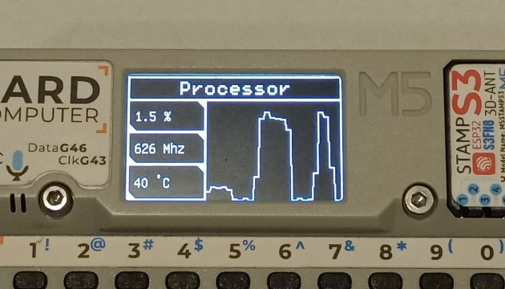
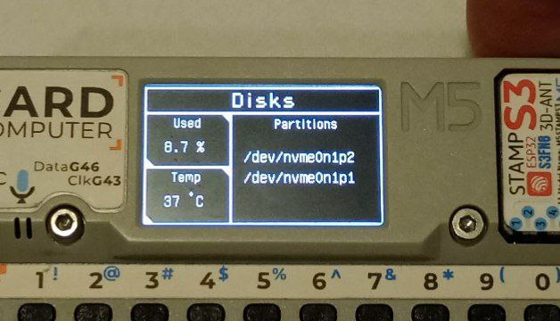
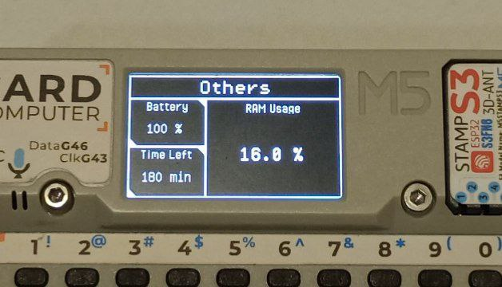

# Cardputer System Monitor
Send sensor data from your computer to the Cardputer via USB.

## Features
### CPU Dashboard 🖥️

- Displays CPU usage percentage;
- Shows CPU frequency in MHz;
- Displays CPU temperature in °C;
- Shows a scroll plot of CPU usage.

### Disks Dashboard 💾

- Displays the percentage of disk usage;
- Shows disk temperature;
- Displays disk partitions;

### Other Dashboard 📊

- Displays battery percentage;
- Shows time remaining until the battery is discharged;
- Displays RAM usage percentage;

## How to run 🚀
- Upload the serial_receiver.ino file to the Cardputer. A screen will appear waiting for a connection;
- Run the serial_sender.py Python file on your computer and select the port for communication;
- Information will start appearing on the Cardputer screen. To switch dashboards, press ButtonA.

## Important ⚠️
- Tested only on Linux devices;
- It has not been tested on Windows, but the Python code logic should not change much;
- If you think you can help me send data via Bluetooth, send me an email (gdantas@tuta.io).
